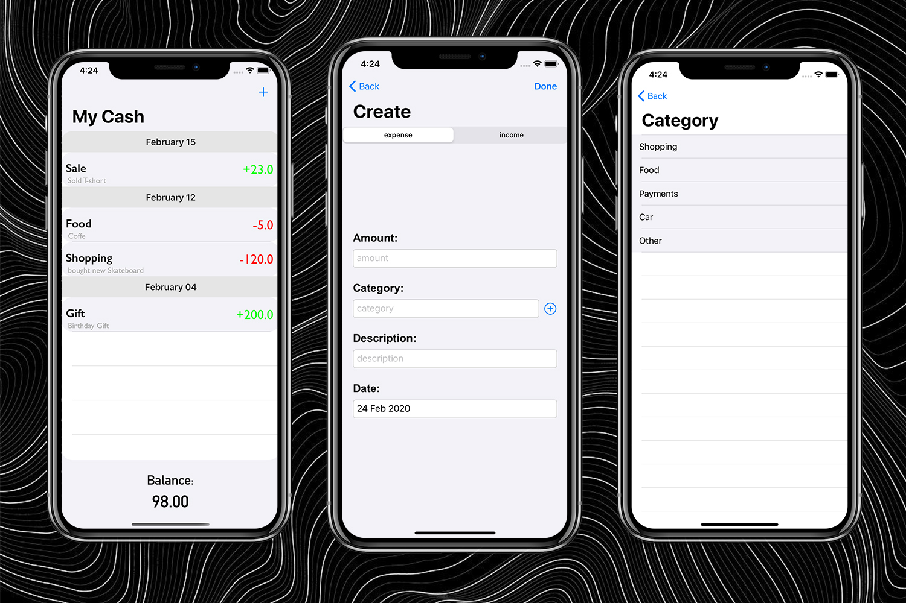

# My Cash

Money management app. For people who wanna know all they self expence and income. This app uses Core Data for storing data.

## Screenshot

 

## License

My Cash is available under the MIT license. See the LICENSE file for more info.

